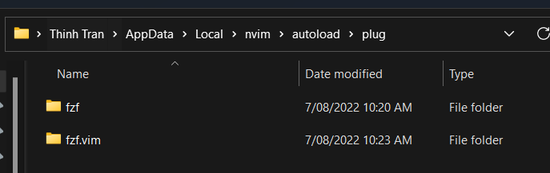

### Install
[Vim-plug](https://github.com/junegunn/vim-plug)

Run this script for NeoVim Windows
```ps1
iwr -useb https://raw.githubusercontent.com/junegunn/vim-plug/master/plug.vim |`
    ni "$(@($env:XDG_DATA_HOME, $env:LOCALAPPDATA)[$null -eq $env:XDG_DATA_HOME])/nvim/autoload/plug.vim" -Force
```
>Note: Vim-plug docs point to `/nvim-data/site/autoload/plug.vim`, but changed to `/nvim/autolaod/plug.vim` to have everything in one place

Add this to `init.vim` file,
```vim
call plug#begin(stdpath('config')/autoload/plug)
Plug 'junegunn/fzf', { 'do': { -> fzf#install() } }
call plug#end()
```
Sometimes its weird and doesn't work, try these instead
```vim
call plug#begin('~/AppData/Local/nvim/autoload/plug')

```

Test by running vim command `:Pl`, then either press `tab` or `Ctrl+d` the plug commands suggestion should appear.


Run `:PluginInstall` to install the fuzzy search `fzf` plugin.


## Install another Plugin
Add `fzf.vim` plugin

[fzf.vim](https://github.com/junegunn/fzf.vim)

```vim
Plug 'junegunn/fzf', { 'do': { -> fzf#install() } }
Plug 'junegunn/fzf.vim'
```

Run `:w` to saved, `:so %` to reload vim, and run `PlugInstall` to install it

Ater install success, `fzf.vim` folder should be added to `plug` folder. (Which is the whole repo from Github)

