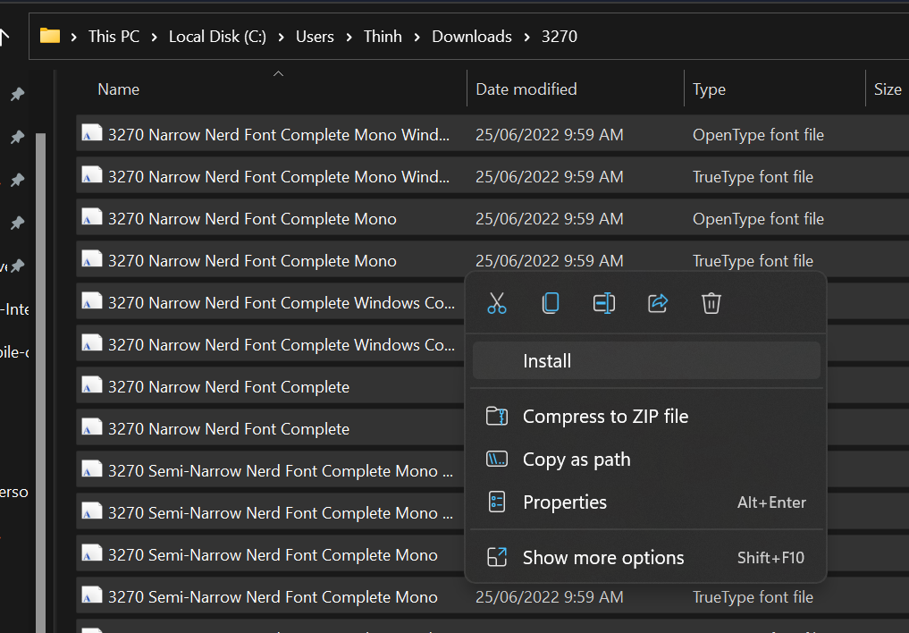
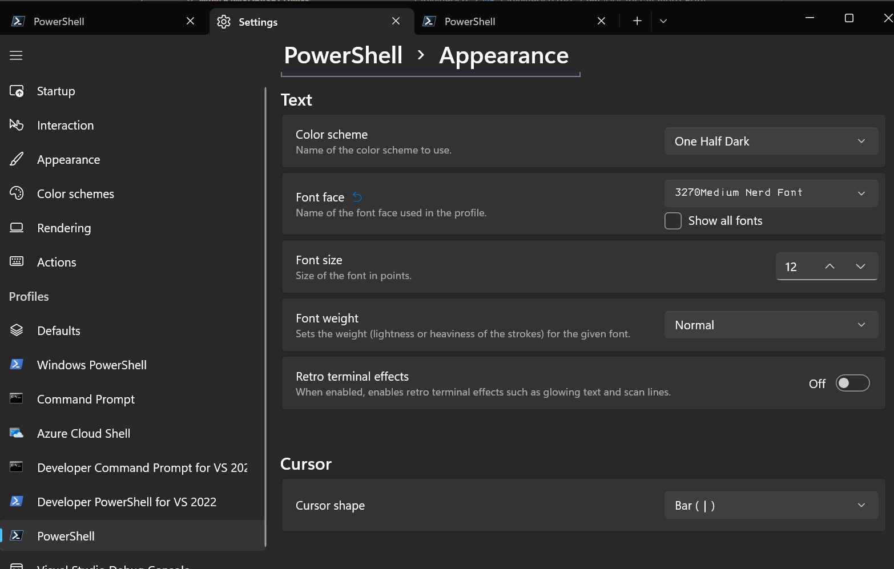

### Install
```powershell
winget install JanDeDobbeleer.OhMyPosh -s winget
```

### Setup to load on startup
Open the powershell user profile `.ps1` file
```powershell
code $PROFILE
```
Add this and save file
```powershell
oh-my-posh init pwsh --config "$env:POSH_THEMES_PATH\bubbles.omp.json" | Invoke-Expression
 ```
---

### Install Nerd Font
https://www.nerdfonts.com/

Install nerd Fonts



#### Select PowerShell font profile



#### Set Terminal font for VS Code `settings.json`
```json
{
    "security.workspace.trust.untrustedFiles": "open",
    "workbench.iconTheme": "material-icon-theme",
    "editor.fontWeight": "normal",
    "terminal.integrated.fontFamily": "'3270Medium Nerd Font'", 
    "terminal.integrated.fontSize": 16,
    "terminal.integrated.rightClickCopyPaste": true,
}
```
